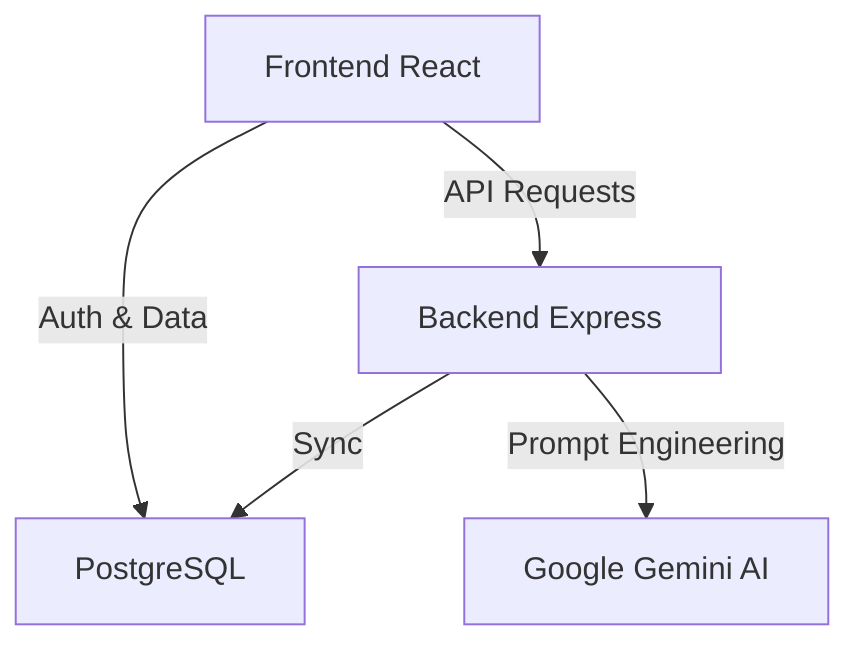

# ⚙️ TaskForge

> [!NOTE]  
> **Acesso demonstrativo:** No login, clique em `Criar minha conta` com qualquer e-mail fictício. Não é necessário confirmar e-mail para testar a ferramenta.

## 🚀 O Projeto
O TaskForge é um gerenciador de tarefas focado em quebrar o bloqueio inicial da procrastinação usando IA (**Gemini 3.1 Pro**). Ele sugere micro-passos de 2 minutos para cada tarefa, integrando um motor de gamificação instantâneo.

## 🏗️ Arquitetura do Sistema



## 🛠️ Stack
- **Front:** React (Vite) + Framer Motion
- **Back:** Node.js (Express)
- **Banco:** PostgreSQL (Supabase)
- **IA:** Google Gemini 3.1 Pro

## ⚙️ Setup Local

1. Clone e entre na pasta:
```bash
git clone https://github.com/ViniciusFrancoS/Task.git
```

2. Configure o `.env` no `/backend` e no `/frontend` (veja o `.env.example` na raiz). No front, use o prefixo `VITE_`.

3. Rode os serviços:
```bash
# Terminal 1 - Backend
cd backend && npm install && npm run dev

# Terminal 2 - Frontend
cd frontend && npm install && npm run dev
```

Acesse em `http://localhost:5173`. 🚀
