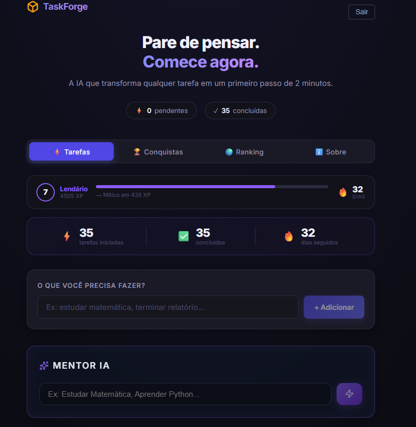
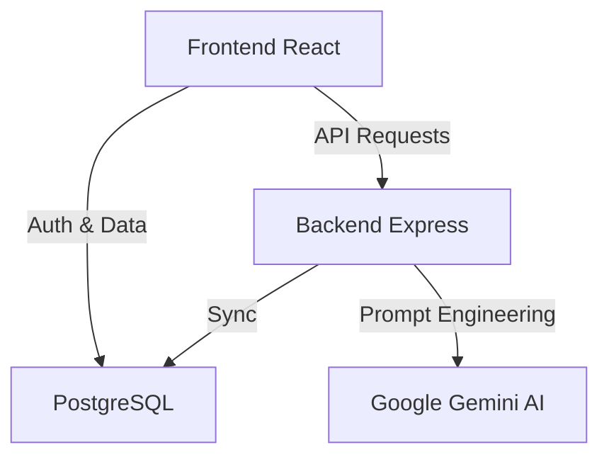

<p align="center">
  
</p>

# TaskForge AI ⚡
> **Transforme intenção em ação. O TaskForge quebra tarefas complexas em passos simples e executáveis.**

TaskForge é um ecossistema de produtividade de alto impacto projetado para combater a procrastinação e a paralisia por análise. Utilizando Inteligência Artificial Generativa, o sistema disseca grandes objetivos em micro-passos táticos, gamificando cada conquista para construir hábitos consistentes.

---

## ✨ Funcionalidades Core

*   **🧠 AI Productivity Mentor:** Motor de IA (Gemini 1.5 Flash) que quebra tarefas nebulosas em ações físicas de menos de 2 minutos.
*   **🎮 Gamificação Nativa:** Sistema robusto de XP, Níveis, Streaks (Sequência) e Conquistas (Badges).
*   **📊 Leaderboard Global:** Ranking em tempo real para incentivo competitivo saudável.
*   **⏱️ Modo Foco:** Ambientação e UX focados na execução profunda (Deep Work).
*   **📱 Interface Premium:** Design Dark Mode ultra-moderno, responsivo e animado com Framer Motion.

---

## 🛠️ Stack Tecnológica

| Camada | Tecnologia |
| :--- | :--- |
| **Frontend** | React 18, Vite, Framer Motion, Lucide Icons |
| **Backend** | Node.js, Express 4 |
| **Banco de Dados** | PostgreSQL (Relacional) |
| **Inteligência Artificial** | Google Gemini 1.5 Flash API |
| **Infraestrutura** | Vercel (Frontend), Render (Backend) |

---

## 🏗️ Arquitetura do Sistema



---

## 📂 Estrutura de Pastas

*   **`/frontend`**: Aplicação cliente com foco em performance (Vite) e estado local com hooks customizados.
*   **`/backend`**: API RESTful organizada por rotas modulares (Tasks, Progress, Badges).
*   **`/docs`**: Documentação de arquitetura e assets visuais.

---

## ⚙️ Instalação e Setup

1.  **Clone o projeto**
    ```bash
    git clone https://github.com/ViniciusFrancoS/Task.git
    cd Task
    ```

2.  **Configuração do Backend**
    ```bash
    cd backend
    npm install
    # Crie um arquivo .env com as credenciais do PostgreSQL e:
    # DATABASE_URL, GEMINI_API_KEY
    npm run dev
    ```

3.  **Configuração do Frontend**
    ```bash
    cd ../frontend
    npm install
    # Crie um arquivo .env com:
    # VITE_API_URL, VITE_GEMINI_KEY
    npm run dev
    ```

---

## 🚀 Próximos Passos (Roadmap)

- [ ] **Modo Pomodoro Integrado** com timer visual.
- [ ] **Extensão para Browser** para captura rápida de tarefas.
- [ ] **Insights Semanais** gerados por IA sobre padrões de produtividade.
- [ ] **Integração com Calendários** (Google/Outlook).

---

## 📄 Licença

Este projeto está sob a licença **MIT**. Veja o arquivo [LICENSE](LICENSE) para detalhes.

---
<p align="center">
  Desenvolvido com 💜 por <a href="https://github.com/ViniciusFrancoS">Vinicius Franco</a>
</p>
