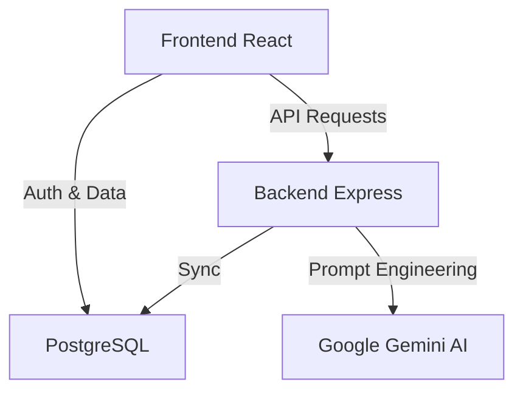

<div align="center">
  
  
  
  
</div>

<h1 align="center">⚙️ TaskForge — Aja Agora.</h1>

<p align="center">
  <b>Um "Desfragmentador de Procrastinação" movido a Inteligência Artificial.</b><br>
  Desenvolvido para transformar tarefas paralisantes em primeiros passos imediatos de 2 minutos.
</p>

---

## 🚀 Sobre o Projeto

TaskForge foi construído não apenas para gerenciar tarefas, mas para **reduzir a fricção cognitiva** de executá-las. Através da IA generativa (*Google Gemini 3.1 Pro*), o sistema quebra o bloqueio criativo, ditando exatamente o que você deve fazer nos próximos minutos, associado a um motor de gamificação instantâneo.

> [!TIP]  
> **Acesso Instantâneo para Avaliação (Zero Atrito)**  
> Se você é um recrutador ou colega desenvolvedor testando este projeto, basta clicar em "Criar minha conta" com qualquer e-mail fictício. **Não há necessidade de confirmação.**

## 🧠 Arquitetura e Decisões de Negócio

Este repositório foi construído seguindo os mais altos padrões de *Clean Architecture* aplicados ao ecossistema React/Node:

- **Feature-Driven Design (FDD):** O frontend está particionado nas pastas `src/core`, `src/features` e `src/shared`. Componentes, lógicas e hooks de negócio (como Gamificação, IA e Tarefas) coexistem isolados e de fácil manutenção, separados da infraestrutura (Supabase/Auth).
- **Gamificação Assíncrona:** Toda ação que gera *XP* local despacha atualizações silenciosas via HTTP. O *Leaderboard* mescla dados globais públicos com *fallback fallback strategy* local para minimizar *layout shifts*.
- **O Fluxo de E-mail (Demonstração vs. Produção):** O projeto possui a integração via SMTP (Resend) e o middleware validando a flag `email_confirmed_at` do JWT. No entanto, **decidi desativar a trava no Supabase e no código por motivos de UX**. Foi uma *Decisão de Design* explícita agilizar o *onboarding* de quem for avaliar esse portfólio.
- **Segurança Invisível (Supabase RLS):** Apesar de qualquer um poder criar conta, a proteção dos dados ocorre via *Row Level Security (RLS)* diretamente no banco PostgreSQL. Ninguém acessa tarefas que não correspondam ao seu próprio `auth.uid()`.

## ⚙️ Stack Tecnológico

**Frontend:** React (Vite), Framer Motion para microinterações fluidas.  
**Backend:** Node.js, Express, Supabase SDK (Server-side validation).  
**Database:** Supabase (PostgreSQL), integrado via JWT Middleware.  
**IA:** Google Gemini 3.1 Pro Model via chamadas *Edge*.

---

## 🏗️ Arquitetura do Sistema



---

## 🛠️ Como Rodar Localmente (Developer Guide)

Quer testar a aplicação na sua própria máquina? Siga o passo a passo:

1. Clone este repositório:
```bash
git clone https://github.com/SeuUsuario/taskforge.git
```

2. Clone as chaves de ambiente:
Crie um arquivo `.env` na pasta **`/backend`** e outro `.env` em **`/frontend`** baseado no arquivo `.env.example` fornecido na raiz. *Nota: No frontend, as variáveis do Supabase precisam do prefixo* `VITE_`.

3. Inicialize os serviços:
```bash
# Terminal 1 - Inicia o servidor backend
cd backend && npm install && npm run dev

# Terminal 2 - Inicia o deamon frontend (Vite)
cd frontend && npm install && npm run dev
```

4. Acesse `http://localhost:5173` e aproveite! 🚀

---
<p align="center">
  <i>Construído com sangue, suor e muito café por Vinicius Franco.</i>
</p>
